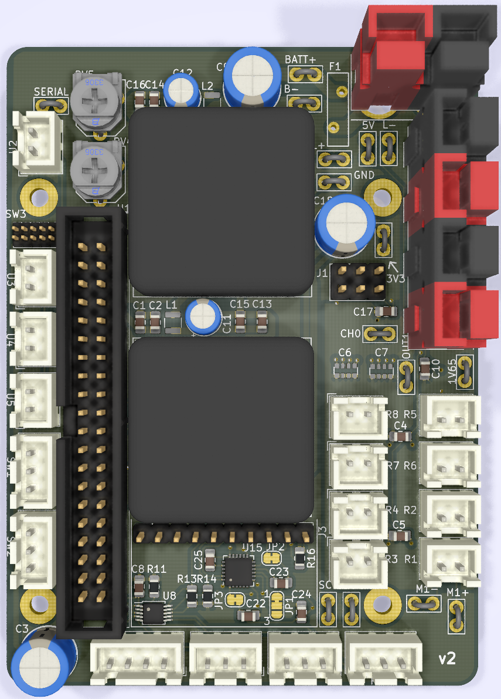

This repository contains the schematic and PCB for the 2019-2020 electrical board. For a walkthrough of this season's progress and an in-depth explanation of the system, see the IPRO report. For a quick glance at the schematic or boards, look in the [PDFs](/PDFs) folder. For information not printed on the schematic (e.g. datasheet links, trace widths), open the files in KiCad.

To view or edit these files, use KiCad version 5. You may need to [install the latest libraries](http://kicad-pcb.org/libraries/download/) if they don't come with your installation.

# Spring 2020: Electrical Team IPRO Report

Gabriel Krell

Gregory Bonnema

Jack Pio

## I. Electrical Team Goals

The NASA RMC at Illinois Tech electrical team's goal was a reliable, professional electrical system for our robot. To accomplish this, we needed to plan the system in a reasonable, realistic way, implement our plan with well-reviewed eCAD, and turn those schematics into a physical robot. This year the team wanted to keep the same topology as previous years, making incremental changes. We aimed to have capable microelectronics and robot control systems running on top of a safe and reliable power system. Our robot would need to adhere to minimum specifications set by the competition (e.g. “The robot should include an emergency stop”) and those set by our goal-planning activity (e.g. “The robot should move”). We also had a nonfunctional goal: to spend as little as reasonably possible, designing to reuse parts from last year and use new parts we had already had. Overall our aim was to continue the success of the past NASA RMC teams, while improving efficiency and overall performance, making it easier to work together with the other subteams.

## II. Power Electronics

Conceptually, we split the electrical design of the robot into two sections. The “power electronics” section was chiefly concerned with getting power from batteries to motors in a safe way.

### A. Initial Design

To lay out our plan for the power electronics section (and eventually make our final schematic), we started from a base of the previous year’s layout. Like other robotics competitions, the rules required an easy-to-reach emergency stop button (“E-stop”). We were also required to measure and display the total power consumed by the robot. On top of these mandatory elements, the relevant section of last year’s robot included:

- A single 3S hobby LiPo battery to power the robot

- A resettable circuit breaker to protect against sustained overcurrent

- A “remote E-stop” (actually a remote-controlled relay unit)

- A smaller, light-up power switch

- A solid-state relay (SSR) to toggle power to the robot

- Sabertooth 2x60 motor controllers to actually move the motors

- A panel-mount battery voltage display

We thought that this layout was simple to implement and was reasonably safe. We were able to build it using only parts that we already possessed from last year’s competition. However, we were concerned that the circuit breaker would take too long to open (10-25 seconds) during a projected overcurrent condition or short circuit. We investigated several options for faster responses: active control with a MOSFET, fast-blow fuses, and different circuit breakers. Unfortunately, breakers or fuses with our desired response characteristics were prohibitively expensive, and our subteam didn’t have the resources to implement active current protection. Ultimately, we compromised by including additional protection for the delicate microelectronics and trusting in the builtin current limiting on individual Sabertooths. Of course, we want to prevent any possible damage to the robot, but since this system includes a working E-stop and does not pose a fire hazard, it meets the relevant safety requirements.

### B. Modifications

We assembled a prototype electrical board as a proof-of-concept and began testing. We found that when motors were stalled, the high current draw would result in significant voltage drops across wires and especially across the SSR. This lowered the available voltage to below that required by the 12V-5V DC-DC converter, resulting in brownouts. We added a second SSR so that the microelectronics would not be affected by the high voltage drop across the SSR. We soon realized, however, that the high current was also causing the battery’s voltage to sag to unacceptable levels. To fix the problem, we added a second battery that would not be responsible for providing high current to the motors. This is not a perfect solution, because it required additional parts and weight, but it would perform well with the supplies on hand.

### C. Motor control

Like last year, we used Sabertooth 2x60 motor controllers. Each channel can supply up to 60A continuous or 120A peak; the Sabertooths are controlled via analog input, an R/C receiver, or serial input. Unfortunately, the controllers return no information about motor output or power consumption. To implement closed-loop control, we added output sensing for all motors: circuits to read the built-in potentiometers on the linear actuators, current sensing resistors on all motors, and a rotary encoder on the most critical motor.

## III. Microelectronics

The second section of the robot’s electronics system was responsible for sensor inputs, computation, and output signals. From the outset, we planned to use a PCB for reliable functionality in a small form factor.

The robot would be run by a single-board computer (SBC). The SBC would sense the outside world through an IMU and two LIDAR sensors, monitor the robot with current and position sensors, and output commands to the motor controllers. We initially used an ASUS Tinker Board, which we exchanged for a more powerful Raspberry Pi 3B+ at the request of the Programming Department.

### A. IMU

We included an inertial measurement unit (IMU) that would report the robot’s velocity and position in space. Because we already had a breakout board from Sparkfun, and because good libraries are available for it, we chose the MPU-6050 for our IMU. The MPU-6050 communicates with the SBC via I2C, a relatively slow multi-device protocol which is easy to connect and route on a circuit board. Sparkfun publishes schematics and board files for their hardware, so we included both the MPU-6050 circuit and headers to connect to the breakout. This way, we could use the expensive breakout board in our first PCB, but use the bare chip if a second version of the PCB forced us to order components.

### B. Potentiometer ADC

The robot incorporates three linear actuators and a four-wire servo to move the regolith collection system and sense how much icy regolith has been collected. All three linear actuators and the servo have built-in potentiometers for position sensing. Because our SBC was not able to read analog inputs by itself, we included an ADC to measure these voltages. We chose the ADS1015, an inexpensive 12-bit ADC that connects to the same I2C bus already used for the IMU. Adafruit sells an ADS1015 breakout board commonly used as an ADC for Raspberry Pis, so the Programming team would enjoy easy-to-use libraries to interface with the chip. Throughout the component selection process, we worked closely with Programming to make sure they would have drivers and libraries to interface with the hardware we chose.

### C. Current Sensing

After struggling with brownouts caused by excessive power consumption by the motors, we became concerned with monitoring motor current. The competition scoring penalized high power usage, but not enough for points to be our motivation. Rather, we wanted the robot to be able to detect when a motor was stalled (high current) or disconnected (no current despite a command to move). This would allow us to prevent system instability caused by current spikes, to improve navigation with this extra information about the robot’s movement, and to increase our eventual competition score.

We measured the voltage across very small (.25mΩ) shunt resistors to calculate the current going through each motor. Two leads from each resistor went to a differential current sense amplifier, which amplified the small bipolar voltage difference into a unipolar voltage high enough to be accurately measured by a fast ADC.

This was probably the most technically difficult part of the project. As the motors spin forwards or backwards, the motor controllers output 12V/0V or 0V/12V on the two leads (referenced to the negative lead of the battery). This means that a shunt resistor on either side will sometimes be at 12V potential, so a “high-side” current measurement system is necessary. Typical ADCs are damaged by inputs higher than their supply voltage (usually 3.3V or 5V), so we had to use a specialized IC to make a high-side differential measurement.

We also needed to amplify this measurement. To avoid large power losses in the resistors, we needed to keep the voltage drop across them as low as possible. To limit resistor consumption to 1W at the max motor current of 60A, we could only allow a voltage drop of 15mV. An ADC’s resolution is evenly distributed over its entire input range, so a 12-bit 3.3V ADC would only have 18 values to choose from to represent current of 0-60A. Amplifying this value before it went into the ADC allowed us to have more precise current measurements.

Finally, we needed to filter the amplified output of the differential measurement. The Sabertooth 2x60 modulates motor power with PWM at 24kHz. The ADC we chose had a maximum sample rate of 75k sps across all 8 channels, well below the Nyquist rate of the signal. Even if we were using a faster ADC, we didn’t want our software to process 384,000 samples per second, which would consume valuable system resources. Instead, we used an RC filter with a cut-off frequency of around 160Hz. This would smooth high-frequency PWM while giving us an accurate picture of changes in motor current. We considered using a Butterworth-response Sallen-Key filter, which has a much sharper cutoff of high frequencies and is easy to implement. But because we needed eight of these filters in limited board space and budget, we went with the RC filter.

## IV. Implementation

Implementation of our design was split into three parts: schematic capture, PCB design, and physical layout of large parts on the robot. We used KiCad for all our eCAD, and tracked versions with GitHub so that everyone was able to see the most up-to-date files.

 

### A. Schematic

We began with a rough schematic focusing on the power electronics. We updated the schematic as we figured out how last year’s robot worked and made our own design changes. Having a reference design helped us quickly build the electrical system for a prototype robot, allowing us to verify the design and let Programming test out their code on real hardware. The prototype bot was invaluable for debugging the brownout problems mentioned in Section II-C. Work on the physical prototype and the schematic proceeded in tandem. Once we had implemented the microelectronics section on perfboard and verified motor control functionality, we were ready to design the PCB. At the same time, we knew that our well-tested power electronics section was unlikely to change, so we began planning the physical layout of the large parts on our robot.

### B. PCB

The PCB was designed over the course of several weeks, with an eye towards a small form factor and easy testability. To save space, we designed the board to stack on top of the SBC, and we included test points for the inevitable debugging sessions later on. After an initial online review, we ordered and tested the first version of the board. This version correctly supported motor control and the IMU, but we quickly realized that unlike the previous year’s Arduino, the Tinker Board does not have a built-in ADC. We had connected the built-in potentiometers of the linear actuators to GPIO pins that could only accept digital input. Luckily, we had scheduled plenty of time for a possible second PCB. We added the necessary ADC, along with some quality-of-life changes and the current sensing detailed in III-C, and ordered a second board.

### C. Physical Layout

With the designs of the PCB and schematic finalized, all that remained was the problem of how to apply these designs onto the robot itself. Given the extremely fine dust present in the competition, we decided to enclose the electrical system in a polycarbonate “e-box”. Our design was sealed with silicone caulk and included a removable front panel which slid on a set of rails. Although not entirely airtight, the box was designed to protect components from major dust contamination. We used weather-resistant panel-mount ports to connect the e-box with the motors, sensors, and emergency stop located elsewhere on the robot.

Our available space was scarcely larger than the total volume of the components, so we made careful mockups of different layouts to come up with a good arrangement. To save space, we stacked pairs of motor controllers, and stacked the PCB on top of the Tinker Board. The rest of the e-box was laid out around these core components, keeping in mind the aforementioned consideration for difficulty of wiring.

## VI. Conclusion

Although this year’s competition was interrupted by the COVID-19 pandemic, we still accomplished many of our goals for the robot and laid a strong foundation for next year. We also explored several promising areas for innovation in next year’s competition.

We designed and implemented a working, safe power system for the robot. We were able to identify historical trouble spots: the datasheet for the SSRs specified a large heat sink, and no heat sink had ever been used. This year, we used advanced phase change composite (PCC) heat sinks donated by AllCell, a local battery manufacturer. The lightweight phase change material absorbs energy as it melts, but is held together by a graphite substrate. This improves the performance and lifetime of the SSRs without adding a prohibitive amount of weight to the robot.

We are also proud of our microelectronics system. Rigorous online review and a schedule that allowed us time for a second spin produced a high-quality board. We were able to catch small issues: for instance, our second version of the board added rounded edges, optional pull-up resistors, and connectors that make it impossible to accidentally connect electrically-incompatible components. The removal of extraneous parts and overall simplification of the system allowed us to make a much more compact system than previous years.

We also accomplished our goal of minimal spending. Historically, the Electrical department has been responsible for a significant portion of the team’s budget. Last year, we spent $3,075 on parts and tools. This year, we spent $410, $232 of which went to soldering stations (the team possessed a single pencil-style iron with a damaged tip). Throughout the season, we designed with price in mind, using cheap or already-owned components.

As of this report, the pandemic has prevented us from receiving components to assemble the PCB, but we are hopeful that the parts will arrive so we can assemble the board and allow Programming to remotely test their software. We are confident in this year’s design, and hope it to be a great stepping stone to the future of the Scarlet Spacehawks.

## VII. Resources

[Don’t Fear the Filter: Lowpass Edition - Elliot Williams for Hackaday](https://hackaday.com/2017/03/08/dont-fear-the-filter-lowpass-edition/)

[Filter Design in Thirty Seconds - Bruce Carter for TI](http://www.ti.com/lit/an/sloa093/sloa093.pdf)
